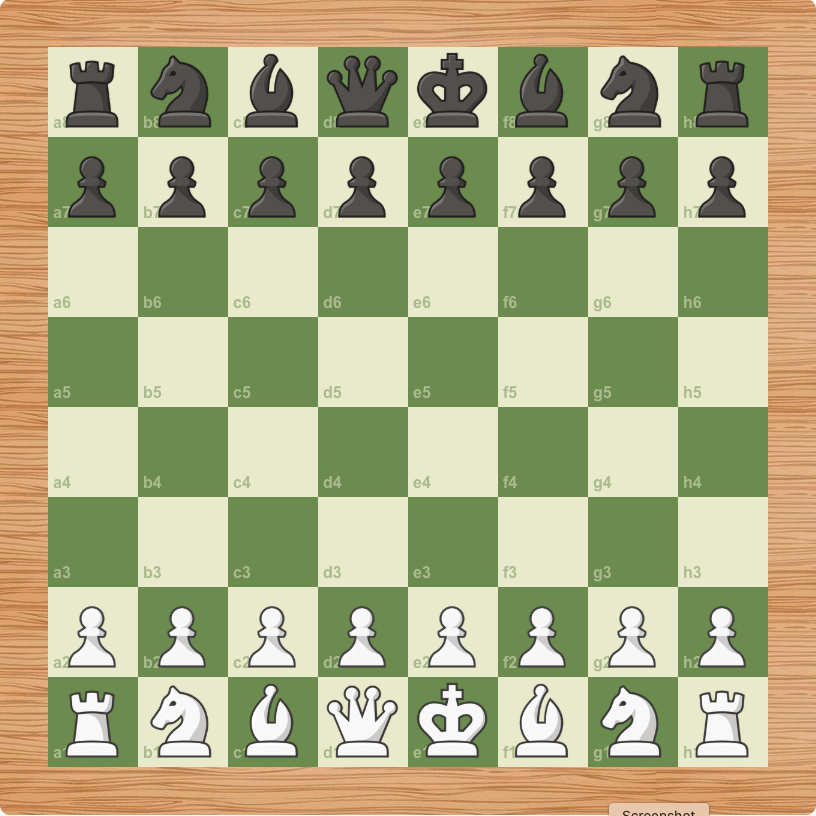

# ♟️ Chess Game — Built with React & Next.js

Welcome to my ✨ **Chess Game Project** ✨ — a modern web-based chess game built using **React**, **Next.js**, and **Tailwind CSS**. This project is part of a complete tutorial series available on my YouTube channel! 🎥📚

## 📸 Preview



---

## 🔍 What is this?

This is a **fully functional, interactive chess game** made for the web. You can move pieces according to official rules, and experience a clean, responsive UI. Great for learning React logic, game rules, and handling user interaction.

---

## 🧠 Features

- ♟️ Move validation based on chess rules
- 🖱️ Drag & Drop or Click-based movement
- 🔄 Turn-based logic (white vs black)
- 🧰 Built with React & Next.js
- ⚛️ Fully responsive design

---

## 🧰 Tech Stack

| Technology | Description                   |
| ---------- | ----------------------------- |
| React      | UI library                    |
| Next.js    | React framework (SSR support) |
| Vercel     | Deployment platform           |

---

## 🎬 Watch the Full Tutorial

📺 YouTube Playlist:  
[➡️ Watch on YouTube](https://www.youtube.com/watch?v=w_YTrDdkrrU&list=PL50lkdW5679jP7dv1B6Se-8J-_MyqXPQu)

I’m teaching everything step-by-step — from setting up the project to deploying it online.

---

## 📦 Getting Started (Run Locally)

```bash
# 1. Clone the repo
git clone https://github.com/shahabkarimifar/Chess-Game-Next-js.git

# 2. Move into the directory
cd Chess-Game-Next-js

# 3. Install dependencies
npm install

# 4. Start the dev server
npm run dev
```
